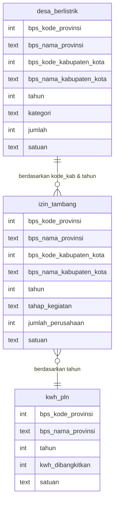

# 📊 Analisis Data Terbuka Aceh - Energi & Sumber Daya Mineral

> **Tugas Kelompok - Analisis Data Menggunakan SQL**  
> Data bersumber dari [Portal Data Aceh](https://data.acehprov.go.id/)

---

## 📌 Daftar Isi

- [Ringkasan Proyek](#-ringkasan-proyek)
- [Entity Relationship Diagram (ERD)](#entity-relationship-diagram-erd)
- [Tema & Dataset](#tema--dataset)
- [Pertanyaan Analitik](#pertanyaan-analitik)
- [Instalasi Tools](#instalasi-tools)
- [Setup Database](#setup-database)
- [Struktur Database](#struktur-database)
- [Query SQL & Analisis](#query-sql--analisis)
  - [Pertanyaan 1: Daerah dengan Tambang Terbanyak](#pertanyaan-1-daerah-dengan-tambang-terbanyak)
  - [Pertanyaan 2: Tren Tambang vs Produksi Listrik PLN](#pertanyaan-2-tren-tambang-vs-produksi-listrik-pln)
  - [Pertanyaan 3: Rasio Desa Berlistrik di Pusat Operasi Tambang](#pertanyaan-3-rasio-desa-berlistrik-di-pusat-operasi-tambang)
- [Hasil Eksekusi Query](#hasil-eksekusi-query)
- [Hasil & Insight](#hasil--insight)
- [Struktur File](#struktur-file)
- [Cara Menjalankan Query](#cara-menjalankan-query)
- [Tim Pengembang](#tim-pengembang)
- [Lisensi](#lisensi)

---

## 🎯 Ringkasan Proyek

Proyek ini merupakan analisis data terbuka dari **Portal Data Aceh** dengan fokus pada tema **Energi dan Sumber Daya Mineral**. Kami menggabungkan tiga dataset utama menggunakan **SQL** untuk menjawab pertanyaan analitik terkait:

- Sebaran perusahaan tambang di Aceh
- Perkembangan produksi listrik PLN
- Akses listrik di desa-desa sekitar area pertambangan

**Tujuan akhir** adalah menghasilkan **infografis** dan **insight** yang dapat mendukung pengambilan keputusan di sektor energi dan pertambangan Aceh.

---

## 🗂 Entity Relationship Diagram (ERD)

Berikut adalah hubungan antar tabel yang digunakan dalam analisis:



**Keterangan Relasi:**
- `desa_berlistrik` dan `izin_tambang` di-**JOIN** menggunakan `bps_kode_kabupaten_kota` dan `tahun`.
- `izin_tambang` dan `kwh_pln` di-**JOIN** menggunakan `tahun` (agregat total tambang per tahun).

---

## 📂 Tema & Dataset

| Tema | Energi dan Sumber Daya Mineral |
|------|--------------------------------|
| **Dataset 1** | `desa_berlistrik` – Jumlah desa dan desa berlistrik per kabupaten/kota (2014–2024) |
| **Dataset 2** | `izin_tambang` – Jumlah perusahaan tambang berdasarkan tahap kegiatan (2022–2024) |
| **Dataset 3** | `kwh_pln` – Total kWh listrik yang dibangkitkan PLN Wilayah Aceh (1968–2024) |

> ✅ Ketiga dataset digabungkan menggunakan teknik **INNER JOIN**, **CTE (Common Table Expression)**, dan **CASE WHEN** untuk analisis lintas tabel.

---

## ❓ Pertanyaan Analitik

| No | Pertanyaan | Teknik SQL |
|----|-----------|------------|
| 1 | Di kabupaten mana jumlah perusahaan tambang paling banyak beroperasi, dan bagaimana kondisi kelistrikan desanya pada tahun yang sama? | `INNER JOIN` + `GROUP BY` + `ORDER BY` |
| 2 | Bagaimana tren pertumbuhan jumlah perusahaan tambang dibandingkan dengan total listrik (kWh) yang dibangkitkan PLN? | `CTE` + `INNER JOIN` |
| 3 | Bagaimana perbandingan rasio total desa dengan desa berlistrik di wilayah pusat operasi tambang terbesar? | Multiple `CTE` + `CASE WHEN` (Pivoting) |

---

## 🛠 Instalasi Tools

Agar semua anggota kelompok dapat menjalankan proyek ini dengan mudah, berikut panduan instalasi untuk **SQLite3**, **DBeaver**, dan **DB Browser for SQLite** di berbagai sistem operasi.

### 1. SQLite3

#### 🐧 Linux (Ubuntu/Debian)
```bash
sudo apt update
sudo apt install sqlite3
```

#### 🐧 Linux (Fedora/RHEL)
```bash
sudo dnf install sqlite
# atau
sudo yum install sqlite
```

#### 🪟 Windows
**Opsi A – Download biner**  
Kunjungi [sqlite.org/download.html](https://www.sqlite.org/download.html) dan unduh:
- `sqlite-tools-win32-x86-*.zip` (untuk 32-bit) atau
- `sqlite-tools-win64-x64-*.zip` (untuk 64-bit)  

Ekstrak dan letakkan `sqlite3.exe` di folder yang mudah diakses, lalu tambahkan path folder tersebut ke **Environment Variables** `PATH`.

**Opsi B – Menggunakan Winget (Windows 10/11)**
```powershell
winget install SQLite.SQLite
```

**Opsi C – Menggunakan Chocolatey**
```powershell
choco install sqlite
```

#### 🍎 macOS
```bash
brew install sqlite3
```

---

### 2. DBeaver

DBeaver adalah tool GUI universal untuk berbagai database, termasuk SQLite. Sangat direkomendasikan untuk eksplorasi dan visualisasi data.

#### 🐧 Linux
- **Snap**:
  ```bash
  sudo snap install dbeaver-ce
  ```
- **APT** (Debian/Ubuntu):
  ```bash
  wget -O - https://dbeaver.io/debs/dbeaver.gpg.key | sudo apt-key add -
  echo "deb https://dbeaver.io/debs/dbeaver-ce /" | sudo tee /etc/apt/sources.list.d/dbeaver.list
  sudo apt update
  sudo apt install dbeaver-ce
  ```

#### 🪟 Windows
- Unduh installer dari [dbeaver.io/download](https://dbeaver.io/download/) (pilih versi Community, gratis).
- Jalankan `.exe` dan ikuti wizard instalasi.

Atau dengan **Winget**:
```powershell
winget install DBeaver.DBeaver
```

#### 🍎 macOS
```bash
brew install --cask dbeaver-community
```

---

### 3. DB Browser for SQLite

Alternatif ringan untuk melihat dan mengedit database SQLite.

#### 🐧 Linux
```bash
sudo snap install sqlitebrowser
```
atau
```bash
sudo apt install sqlitebrowser
```

#### 🪟 Windows
Unduh installer dari [sqlitebrowser.org/dl](https://sqlitebrowser.org/dl/) dan jalankan.

#### 🍎 macOS
```bash
brew install --cask db-browser-for-sqlite
```

---

## ⚙️ Setup Database

### 1. Clone Repository

```bash
git clone https://github.com/Haykal20/analisis-energi.git
cd analisis-energi
```

---

### 2. Inisialisasi Database

Kami menggunakan **SQLite**, sehingga tidak perlu instalasi server terpisah.

#### Opsi A — Restore dari Dump (TERCEPAT)
```bash
sqlite3 database.db < dump.txt
```

#### Opsi B — Jalankan Skrip Query
```bash
sqlite3 database.db < query1.sql   # membuat tabel
sqlite3 database.db < query2.sql   # menjalankan analisis
```

#### Opsi C — Import CSV Manual
```bash
sqlite3 database.db
.mode csv
.import data/desa_berlistrik.csv desa_berlistrik
.import data/izin_tambang.csv izin_tambang
.import data/kwh_pln.csv kwh_pln
```

---

### 3. Verifikasi Data

```bash
sqlite3 database.db
.tables
SELECT COUNT(*) FROM desa_berlistrik;
SELECT COUNT(*) FROM izin_tambang;
SELECT COUNT(*) FROM kwh_pln;
.exit
```

---

## 📊 Struktur Database

### Tabel `desa_berlistrik`

| Kolom | Tipe | Keterangan |
|-------|------|------------|
| `bps_kode_provinsi` | INTEGER | Kode provinsi (selalu 11 untuk Aceh) |
| `bps_nama_provinsi` | TEXT | Nama provinsi |
| `bps_kode_kabupaten_kota` | INTEGER | Kode kabupaten/kota |
| `bps_nama_kabupaten_kota` | TEXT | Nama kabupaten/kota |
| `tahun` | INTEGER | Tahun data |
| `kategori` | TEXT | `jumlah_desa` atau `jumlah_desa_berlistrik` |
| `jumlah` | INTEGER | Jumlah desa |
| `satuan` | TEXT | Satuan (unit) |

### Tabel `izin_tambang`

| Kolom | Tipe | Keterangan |
|-------|------|------------|
| `bps_kode_provinsi` | INTEGER | Kode provinsi |
| `bps_nama_provinsi` | TEXT | Nama provinsi |
| `bps_kode_kabupaten_kota` | INTEGER | Kode kabupaten/kota |
| `bps_nama_kabupaten_kota` | TEXT | Nama kabupaten/kota |
| `tahun` | INTEGER | Tahun data |
| `tahap_kegiatan` | TEXT | `Eksplorasi`, `Operasi Produksi`, `Jasa Penambangan`, dll |
| `jumlah_perusahaan` | INTEGER | Jumlah perusahaan |
| `satuan` | TEXT | Satuan (unit) |

### Tabel `kwh_pln`

| Kolom | Tipe | Keterangan |
|-------|------|------------|
| `bps_kode_provinsi` | INTEGER | Kode provinsi |
| `bps_nama_provinsi` | TEXT | Nama provinsi |
| `tahun` | INTEGER | Tahun data |
| `kwh_dibangkitkan` | INTEGER | Total kWh yang dibangkitkan |
| `satuan` | TEXT | Satuan (kwh) |

---

## 🔍 Query SQL & Analisis

Semua query tersimpan dalam file **`query2.sql`** dengan komentar. Berikut adalah tiga query utama beserta **penjelasan kode** secara rinci.

---

### Pertanyaan 1: Daerah dengan Tambang Terbanyak

**Tujuan:** Mengetahui kabupaten/kota dengan jumlah perusahaan tambang terbanyak (semua tahap) dan melihat akses listrik desanya pada tahun yang sama.

```sql
SELECT 
    i.bps_nama_kabupaten_kota AS nama_kabupaten,
    i.tahun,
    SUM(i.jumlah_perusahaan) AS total_perusahaan_tambang,
    d.jumlah AS jumlah_desa_berlistrik
FROM 
    izin_tambang i
INNER JOIN 
    desa_berlistrik d 
    ON i.bps_kode_kabupaten_kota = d.bps_kode_kabupaten_kota 
    AND i.tahun = d.tahun
WHERE 
    d.kategori = 'jumlah_desa_berlistrik' 
    AND i.jumlah_perusahaan > 0
GROUP BY 
    i.bps_nama_kabupaten_kota, 
    i.tahun
ORDER BY 
    total_perusahaan_tambang DESC
LIMIT 5;
```

**Penjelasan:**

- **`FROM izin_tambang i`** – tabel utama berisi data perusahaan tambang.
- **`INNER JOIN desa_berlistrik d`** – menggabungkan dengan tabel desa berlistrik berdasarkan:
  - `bps_kode_kabupaten_kota` (kode wilayah yang sama)
  - `tahun` (data pada tahun yang sama)
- **`WHERE d.kategori = 'jumlah_desa_berlistrik'`** – hanya ambil baris yang menunjukkan jumlah desa **yang sudah berlistrik** (bukan total desa).
- **`AND i.jumlah_perusahaan > 0`** – hilangkan kabupaten tanpa perusahaan tambang.
- **`GROUP BY i.bps_nama_kabupaten_kota, i.tahun`** – agregasi per kabupaten per tahun.
- **`SUM(i.jumlah_perusahaan)`** – total perusahaan tambang (semua tahap) di kabupaten tersebut.
- **`ORDER BY total_perusahaan_tambang DESC LIMIT 5`** – ambil 5 kabupaten dengan jumlah tambang tertinggi.

---

### Pertanyaan 2: Tren Tambang vs Produksi Listrik PLN

**Tujuan:** Membandingkan jumlah total perusahaan tambang di seluruh Aceh dengan total kWh listrik yang dibangkitkan PLN per tahun.

```sql
WITH TotalTambangPerTahun AS (
    SELECT 
        tahun, 
        SUM(jumlah_perusahaan) AS total_perusahaan
    FROM 
        izin_tambang
    GROUP BY 
        tahun
)
SELECT 
    t.tahun, 
    t.total_perusahaan, 
    k.kwh_dibangkitkan
FROM 
    TotalTambangPerTahun t
INNER JOIN 
    kwh_pln k 
    ON t.tahun = k.tahun
ORDER BY 
    t.tahun ASC;
```

**Penjelasan:**

- **`WITH TotalTambangPerTahun AS (...)`** – CTE (Common Table Expression) untuk menghitung total perusahaan tambang per tahun di seluruh Aceh.
  - `SUM(jumlah_perusahaan)` menjumlahkan semua perusahaan dari semua kabupaten pada tahun tersebut.
- **`SELECT t.tahun, t.total_perusahaan, k.kwh_dibangkitkan`** – ambil tahun, total tambang, dan kWh.
- **`INNER JOIN kwh_pln k ON t.tahun = k.tahun`** – gabungkan dengan tabel listrik berdasarkan tahun.
- **`ORDER BY t.tahun ASC`** – urutkan dari tahun terkecil ke terbesar untuk melihat tren.

---

### Pertanyaan 3: Rasio Desa Berlistrik di Pusat Operasi Tambang

**Tujuan:** Menghitung rasio desa berlistrik di 5 kabupaten dengan jumlah perusahaan tambang **tahap operasi produksi** terbanyak.

```sql
WITH DataListrik AS (
    SELECT 
        bps_kode_kabupaten_kota,
        bps_nama_kabupaten_kota,
        tahun,
        MAX(CASE WHEN kategori = 'jumlah_desa' THEN CAST(jumlah AS INTEGER) END) AS total_desa,
        MAX(CASE WHEN kategori = 'jumlah_desa_berlistrik' THEN CAST(jumlah AS INTEGER) END) AS desa_berlistrik
    FROM 
        desa_berlistrik
    GROUP BY 
        bps_kode_kabupaten_kota, 
        tahun
),
DataTambang AS (
    SELECT 
        bps_kode_kabupaten_kota,
        tahun,
        SUM(jumlah_perusahaan) AS total_produksi
    FROM 
        izin_tambang
    WHERE 
        tahap_kegiatan LIKE '%Operasi Produksi%'
    GROUP BY 
        bps_kode_kabupaten_kota, 
        tahun
)
SELECT 
    l.bps_nama_kabupaten_kota,
    l.tahun,
    l.total_desa,
    l.desa_berlistrik,
    t.total_produksi AS jumlah_tambang_produksi
FROM 
    DataListrik l
INNER JOIN 
    DataTambang t 
    ON l.bps_kode_kabupaten_kota = t.bps_kode_kabupaten_kota 
    AND l.tahun = t.tahun
ORDER BY 
    t.total_produksi DESC
LIMIT 5;
```

**Penjelasan:**

- **CTE `DataListrik`** – melakukan **pivoting** pada tabel `desa_berlistrik`:
  - `MAX(CASE WHEN kategori = 'jumlah_desa' THEN CAST(jumlah AS INTEGER) END)` mengambil nilai `jumlah` ketika kategori = `'jumlah_desa'` (total desa).
  - `MAX(CASE WHEN kategori = 'jumlah_desa_berlistrik' THEN CAST(jumlah AS INTEGER) END)` mengambil nilai `jumlah` untuk desa berlistrik.
  - `GROUP BY kode_kabupaten, tahun` – setiap baris mewakili satu kabupaten pada satu tahun, dengan dua kolom: total desa dan desa berlistrik.
- **CTE `DataTambang`** – menghitung total perusahaan tambang yang **berada dalam tahap operasi produksi** (`tahap_kegiatan LIKE '%Operasi Produksi%'`) per kabupaten per tahun.
- **Gabungkan** kedua CTE dengan `INNER JOIN` pada `kode_kabupaten` dan `tahun`.
- **`ORDER BY total_produksi DESC LIMIT 5`** – ambil 5 kabupaten dengan jumlah perusahaan produksi terbanyak.

---

## 📊 Hasil Eksekusi Query

Berikut adalah output yang diperoleh setelah menjalankan `query2.sql` pada SQLite:

### Hasil Pertanyaan 1: 5 Kabupaten dengan Tambang Terbanyak

| Nama Kabupaten | Tahun | Total Perusahaan Tambang | Jumlah Desa Berlistrik |
|----------------|-------|--------------------------|------------------------|
| Kabupaten Aceh Tamiang | 2022 | 66 | 216 |
| Kabupaten Pidie | 2022 | 58 | 730 |
| Kabupaten Aceh Besar | 2022 | 51 | 604 |
| Kabupaten Aceh Tamiang | 2024 | 45.0 | 216 |
| Kabupaten Bireuen | 2022 | 43 | 609 |

> **Catatan:** Angka desimal (45.0) muncul karena SQLite menangani tipe data campuran; nilai sebenarnya adalah 45 (integer).

---

### Hasil Pertanyaan 2: Tren Tambang vs kWh PLN

| Tahun | Total Perusahaan Tambang (seluruh Aceh) | kWh Dibangkitkan |
|-------|------------------------------------------|------------------|
| 2022  | 455.0                                    | 3.580.232.811    |
| 2023  | 309.0                                    | 3.895.093.332    |
| 2024  | 360.0                                    | 4.162.316.385    |

---

### Hasil Pertanyaan 3: 5 Kabupaten dengan Operasi Produksi Terbanyak & Rasionya

| Kabupaten | Tahun | Total Desa | Desa Berlistrik | Jumlah Tambang Produksi |
|-----------|-------|------------|-----------------|-------------------------|
| Kabupaten Aceh Tamiang | 2022 | 216 | 216 | 49 |
| Kabupaten Aceh Tamiang | 2024 | 216 | 216 | 39.0 |
| Kabupaten Pidie | 2022 | 730 | 730 | 38 |
| Kabupaten Aceh Besar | 2022 | 604 | 604 | 35 |
| Kabupaten Bireuen | 2022 | 609 | 609 | 28 |

Semua kabupaten tersebut memiliki **rasio desa berlistrik 100%** (`total_desa = desa_berlistrik`).

---

## 📈 Hasil & Insight

### Insight 1: Aceh Tamiang adalah Pusat Tambang Terbesar
- Berdasarkan data 2022 dan 2024, Kabupaten Aceh Tamiang mendominasi jumlah perusahaan tambang (66 pada 2022, 45 pada 2024) maupun tahap operasi produksi (49 pada 2022).
- **Kondisi listrik:** seluruh 216 desa di Aceh Tamiang sudah berlistrik 100% pada tahun yang sama.

### Insight 2: Penurunan Jumlah Tambang Diiringi Kenaikan Produksi Listrik
- Jumlah total perusahaan tambang di Aceh menurun dari 455 (2022) ke 309 (2023), lalu naik lagi ke 360 (2024).
- Produksi listrik PLN justru terus meningkat: dari 3,58 miliar kWh ke 4,16 miliar kWh.
- **Korelasi:** penurunan tambang tidak menghambat pertumbuhan listrik; kemungkinan disebabkan oleh peningkatan konsumsi rumah tangga, industri non-tambang, atau penambahan pembangkit.

### Insight 3: Wilayah Tambang Besar = Akses Listrik Universal
- Lima kabupaten dengan operasi tambang produksi terbanyak semuanya mencapai 100% desa berlistrik.
- Ini mengindikasikan bahwa aktivitas pertambangan berkorelasi positif dengan pembangunan infrastruktur listrik di daerah tersebut.

---

## 📁 Struktur File

```
📂 repo-analisis-aceh/
├── 📄 README.md                         # Dokumentasi lengkap (file ini)
├── 📄 database.db                        # Database SQLite (hasil build)
├── 📄 dump.txt                           # SQL dump untuk restore cepat
├── 📄 query1.sql                         # Skrip pembuatan tabel
├── 📄 query2.sql                         # Skrip analisis (3 pertanyaan)
├── 📄 struktur.txt                       # Struktur folder proyek
├── 📄 .gitignore                         # File yang diabaikan git
│
├── 📂 data/                              # Dataset asli (CSV)
│   ├── data-izin-usaha-pertambangan.csv
│   ├── jumlah-desa-dan-desa-yang-berlistrik-menurut-kabupaten-kota-di-provinsi.csv
│   └── jumlah-kwh-yang-dibangkitkan-pt.-pln-persero-wilayah-aceh-1998-2024.csv
│
├── 📂 output/                            # Hasil analisis
│   ├── infografis.png                    # Infografis final
│   └── laporan.pdf                       # Laporan singkat
│
└── 📂 docs/                              # Dokumentasi tambahan
    ├── screenshot-query.png              # Screenshot hasil query
    └── erd.png                           # Entity Relationship Diagram (gambar)
```

---

## 🚀 Cara Menjalankan Query

### Menggunakan SQLite CLI

```bash
# Jalankan semua query (hasil akan tampil di terminal)
sqlite3 database.db < query2.sql

# Atau masuk ke interactive shell
sqlite3 database.db
.read query2.sql
```

### Menggunakan DBeaver (GUI)

1. Buka DBeaver.
2. Klik **New Database Connection** → pilih **SQLite**.
3. Pada field **Path**, browse ke file `database.db` dalam folder proyek.
4. Klik **Test Connection** → jika berhasil, klik **Finish**.
5. Buka tab **SQL Editor**, salin query dari `query2.sql`, lalu jalankan (Ctrl+Enter / F9).
6. Hasil bisa diekspor ke CSV atau langsung divisualisasikan.

### Menggunakan DB Browser for SQLite

1. Buka DB Browser.
2. Klik **Open Database** → pilih `database.db`.
3. Buka tab **Execute SQL**, tempel query, lalu klik tombol **Play**.
4. Hasil akan muncul di panel bawah, bisa disimpan sebagai CSV.

### Ekspor Hasil ke CSV (CLI)

```bash
sqlite3 database.db -header -csv "SELECT * FROM your_query;" > hasil.csv
```

---

## 👥 Tim Pengembang

| Nama | NIM | Peran |
|------|-----|-------|
| Haykal Furqan Shafiq | 24210076 | Analisis Data, Query SQL, Dataset |
| Haffidz Maulana | 24210057 ||
| Salmansah | 24210207 ||
| Rian Ferdiansyah | 24210205 ||
| iqbal fahimi | 24210198 ||
| Aldi elmanda | 24210215 ||

---

## 📜 Lisensi

Proyek ini dibuat untuk keperluan **tugas akademik** dan bersifat open-source. Data bersumber dari [Portal Data Aceh](https://data.acehprov.go.id/) dengan lisensi **Creative Commons Attribution-ShareAlike 4.0 International (CC BY-SA 4.0)**.

---

## 🙏 Ucapan Terima Kasih

- **Portal Data Aceh** atas penyediaan data terbuka.
- **Dosen Pengampu** atas bimbingan dan arahan.
- Seluruh anggota kelompok atas kerjasama dan dedikasi.

---

> **"Data is the new oil — but only if you know how to refine it."**

📬 **Kontak:** Untuk pertanyaan lebih lanjut, silakan buka *issue* di repository ini atau hubungi dosen pengampu.

---

**Selamat Menganalisis! 🚀**